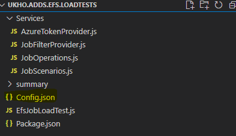
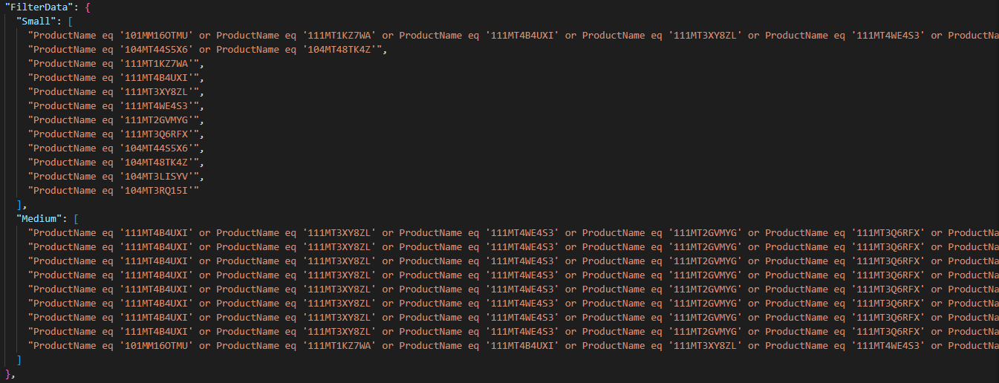
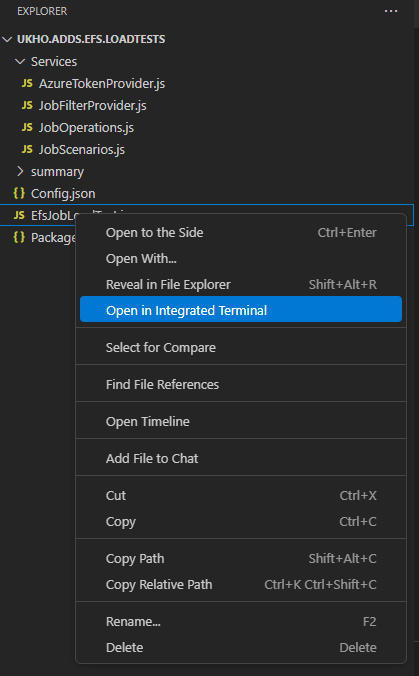
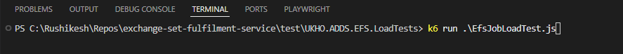
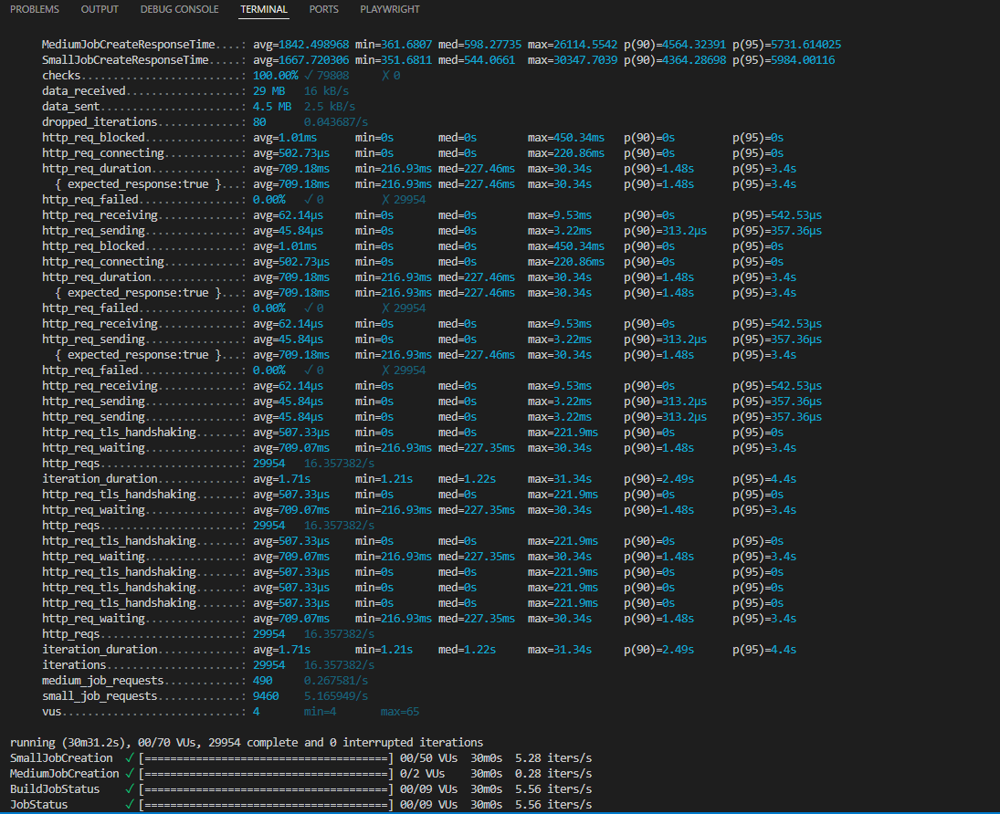
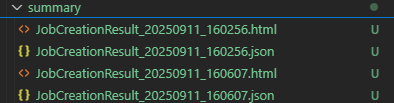
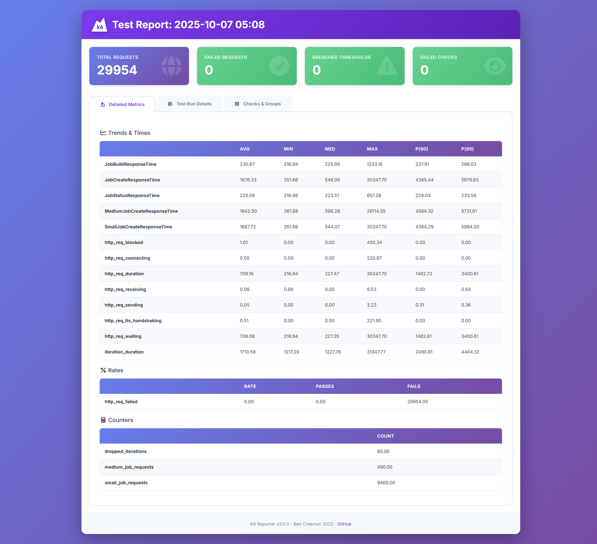

# EFS Load Test Execution Guide

This guide explains how to execute the Exchange Set Fulfilment Service (EFS) load tests using k6.

---

## 1. Scripts Location

The EFS load test scripts are hosted on GitHub. You can access them at the following location:

[GitHub - EFS Load Tests](https://github.com/UKHO/exchange-set-fulfilment-service/tree/main/test/UKHO.ADDS.EFS.LoadTests)

**Steps:**

1. Clone or download the repository to your local machine.  
2. Open the `UKHO.ADDS.EFS.LoadTests` folder in **Visual Studio Code** to view and edit the scripts.  

<details>
<summary>Open Folder Screenshot</summary>

<p>
  
</p>

</details>


## 2. Update Config.json

Open the `Config.json` file and update the following parameters:

| Parameter           | Description                                                                                     | Example / Notes                                                                                       |
|--------------------|-------------------------------------------------------------------------------------------------|------------------------------------------------------------------------------------------------------|
| `Base_URL`          | URL of the EFS orchestrator endpoint.                                                          | `"https://efs-orchestrator.livelyfield-991deae6.uksouth.azurecontainerapps.io"`                     |
| `NumberOfRequests`  | Total number of requests to send during the test.                                               | `10000`                                                                                              |
| `DurationInSeconds` | Total test duration in seconds.                                                                | `1800`                                                                                               |
| `EFSToken`          | Authentication token for EFS API.                                                              | Leave empty initially, use token generated from the URL below                                        |
| `CompletedJobId`    | Any successfully completed job id from a previous test run.                                     | Example: `44e4a996-968c-8929-d023-199484c2b787`                                                                                    |

**URL for token generation:**  
[Generate Token](https://login.microsoftonline.com/9134ca48-663d-4a05-968a-31a42f0aed3e/oauth2/v2.0/authorize?client_id=b9daf591-caa1-40c6-af59-2ee69e776d89&response_type=token&scope=b9daf591-caa1-40c6-af59-2ee69e776d89/.default&redirect_uri=https://jwt.ms)

> ⚠️ Notes:
> - Copy the token from the redirect page (`https://jwt.ms`) and paste it into `EFSToken`.
> - The data sets have been pre-configured in `Config.json`:
>   - **Small sets:** 10–50 MB  
>   - **Medium sets:** 50–280 MB  

<details>
<summary>Config Data Sets Screenshot</summary>



</details>


---

## 3. Execute the Load Test

1. Right-click `EfsJobLoadTest.js` and select **Open in Integrated Terminal** in VS Code.

<details>
<summary>Open Terminal Screenshot</summary>





</details>

2. Run the test script using k6:

```bash
k6 run .\EfsJobLoadTest.js

```
## 4. View Execution Results

After the test completes, the terminal will display the results summary:


<details>
<summary>Execution Results Screenshot</summary>



</details>

4.1 HTML Report

An HTML report is generated in the summary folder.

Open the report in a browser for detailed metrics.

<details>
<summary>HTML Report Screenshot</summary>





</details>
